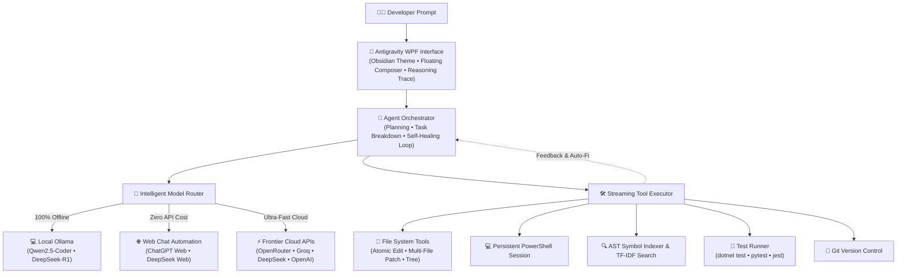

# ⚡ OmniCoder Pilot — Autonomous Local & Cloud AI Software Engineer

<p align="center">
  <a href="https://github.com/WESAM-ALSELWI/OmniCoderPilot"></a>
  <a href="https://dotnet.microsoft.com/download"></a>
  <a href="https://ollama.ai"></a>
  <a href="#-web-chat-mode-chat2api-zero-api-cost"></a>
  <a href="https://openrouter.ai"></a>
  <a href="https://groq.com"></a>
  <a href="LICENSE"></a>
</p>

<p align="center">
  <strong>An autonomous, privacy-first AI software engineer and code editor desktop application for Windows.</strong><br>
  Built with <strong>.NET 10 & WPF</strong>, designed with a sleek <strong>Google Antigravity-inspired obsidian interface</strong>, and engineered for <strong>100% offline Local LLMs</strong>, <strong>Frontier Cloud APIs</strong>, and <strong>Zero-Cost Web Chat Automation</strong>.
</p>

---

## 🌟 Why OmniCoder Pilot?

Modern AI coding assistants usually force a compromise: either pay heavy monthly subscription fees, expose your private source code to third-party cloud servers, or settle for simplistic autocomplete plugins.

**OmniCoder Pilot** delivers a full-fledged **autonomous software engineer** on your desktop:

* 🛡️ **Total Privacy Sovereignty**: Run 100% offline models with [Ollama](https://ollama.ai) (`qwen2.5-coder`, `deepseek-r1`, `llama3.3`). Not a single byte leaves your machine.
* 💸 **Zero-Cost Web Chat Automation (Chat2API)**: Drive ChatGPT Web and DeepSeek Web through embedded, headless browser automation without needing API keys or paying token costs.
* ⚡ **Frontier Multi-Cloud Flexibility**: Connect seamlessly to OpenRouter (200+ models), Groq (blazing-fast free cloud inference), DeepSeek Official, OpenAI Official, or any self-hosted OpenAI-compatible endpoint (vLLM, LM Studio, LiteLLM).
* 🎨 **Google Antigravity Design System**: Premium obsidian canvas (`#121316`), crisp contrast typography, reasoning trace accordions, floating composer, and collapsible multi-pane workspace.
* 🤖 **Autonomous Multi-Turn Execution**: OmniCoder inspects directories, reads and atomically modifies multiple files, manages Git branches, executes terminal commands, and self-heals broken builds or failing unit tests.

---

## 🚀 Key Features & Capabilities



### 1. 🎨 Google Antigravity-Inspired Modern UI/UX
* **Obsidian Canvas (`#121316`)**: Eye-friendly dark palette with high-contrast text (`#F3F4F6`), subtle Aurora glowing accents, and crisp typography.
* **Top Navigation Bar**: Displays current workspace folder status pill, active model selector, and system health badges.
* **Hero Welcome Screen**: 4 one-click quick-action prompt chips (*"Explain Codebase"*, *"Find & Fix Bugs"*, *"Run & Fix Tests"*, *"Refactor Code"*) to jumpstart development.
* **Reasoning Trace Accordion**: Native folding container for models with internal chain-of-thought (DeepSeek R1 `<think>` tokens, o1/o3-mini, and Antigravity-style reasoning).
* **Floating Composer Card**: Rounded composer dock (`CornerRadius="18"`) with responsive multiline input, instant model switching, and Web Chat toggle.
* **Collapsible Sidebars (`◫`)**: Toggle side panels and tool inspect panels with a single shortcut to maximize code workspace.

### 2. 🌐 Web Chat Mode (Chat2API — Zero API Cost)
* **Drive Web Assistants Directly**: Automates **ChatGPT Web** (`chatgpt.com`) and **DeepSeek Web** (`chat.deepseek.com`) directly from inside OmniCoder Pilot without requiring paid API subscriptions.
* **6-Layer ProseMirror Input Pipeline**:
  1. *ProseMirror View Dispatch*: Injects transactions directly into ProseMirror's document state (`view.dispatch(tr.insertText(...))`).
  2. *Synthetic Clipboard Paste*: Emulates native `DataTransfer` paste events to preserve complex formatting and multi-line markdown.
  3. *Native `document.execCommand`*: Emulates keyboard selection and text insertion on focused ranges.
  4. *Synthetic Input Events*: Triggers `beforeinput` and `input` events.
  5. *Safe DOM Paragraph Handling*: Injects structured paragraphs without wiping ProseMirror's internal state.
  6. *Chrome DevTools Protocol (CDP)*: Direct low-level virtual keyboard fallback.
* **Continuous Single-Thread Conversations**: Preserves a single, continuous conversation thread across endless turns (no new thread created per message), keeping full chat history context intact.
* **DOM Virtualization Resilient**: Snapshot-aware response polling that survives browser DOM pruning and virtualization in long conversation threads.
* **Embedded WebView2 Engine**: Operates in a high-resolution desktop viewport (`1280x900`) with in-app interactive login window and account management.

### 3. 💻 100% Offline Local AI (Ollama)
* **Zero Telemetry**: Keep sensitive codebases, proprietary IP, and confidential credentials completely off the internet.
* **Native Tool Calling**: Fully supports function calling with local code models (`qwen2.5-coder:7b`, `qwen2.5-coder:32b`, `deepseek-r1:8b`, `llama3.3:8b`).
* **Hardware Optimized**: Supports GPU acceleration via CUDA, ROCm, and Apple Silicon offloading through Ollama.

### 4. ⚡ Frontier Multi-Cloud AI Routing
* **OpenRouter**: Access 200+ frontier models, including `anthropic/claude-3.5-sonnet`, `openai/gpt-4o`, `google/gemini-2.5-flash`, and open-source models.
* **Groq**: Free, ultra-low latency inference on `llama-3.3-70b-versatile` and `qwen-2.5-coder-32b`.
* **DeepSeek Official API**: Direct high-speed API connectivity for `deepseek-chat` (V3) and `deepseek-reasoner` (R1).
* **OpenAI Official API**: First-class support for `gpt-4o`, `gpt-4o-mini`, `o1`, and `o3-mini`.
* **Custom OpenAI-Compatible Endpoints**: Connect to LM Studio, vLLM, LiteLLM, GitHub Models, or Together AI with custom base URLs and headers.

### 5. 🛠️ Autonomous Developer Tool Suite
| Category | Tools & Capabilities |
|---|---|
| **📁 File Operations** | `ReadFile`, `WriteFile`, `EditBlock` (atomic block replacement), `ListDirectory`, `FindFiles`, file tree exploration |
| **🔍 Search & Indexing** | AST symbol extraction for **C#, Python, JavaScript, TypeScript, Go, Java, Rust**; SHA256 caching; TF-IDF semantic repository search |
| **💻 Persistent Shell** | Dedicated PowerShell session preserving environment variables, virtual environments, path changes, and tool context |
| **🌿 Git Suite** | `git status`, `git diff`, `git log`, `git blame`, atomic commit creation, and branch management |
| **🧪 Self-Healing Test Loop** | Auto-detects test runners (**dotnet test**, **pytest**, **jest**, **vitest**); runs test suites and iterates on code until tests pass |
| **📄 Document Processing** | Ingests and inspects local documentation, PDF, Word, Excel, and Markdown files |
| **🌐 NuGet & Web Research** | Queries live NuGet packages, API documentation, and web resources |

---

## 📊 Supported Providers & Capabilities Matrix

| Provider / Engine | Supported Models | Function Calling | Privacy | Cost |
|---|---|:---:|:---:|---|
| **💻 Local Ollama** | `qwen2.5-coder:7b/32b`, `deepseek-r1`, `llama3.3` | ✅ Native | 🔒 100% Offline | **Free** |
| **🌐 Web Chat (ChatGPT)** | ChatGPT Web (GPT-4o, Free / Plus) | ✅ Automated | 🛡️ Browser Session | **Free (No API Key)** |
| **🌐 Web Chat (DeepSeek)**| DeepSeek Web (V3, R1) | ✅ Automated | 🛡️ Browser Session | **Free (No API Key)** |
| **⚡ Groq Cloud** | `llama-3.3-70b-versatile`, `qwen-2.5-coder-32b` | ✅ Native | ☁️ Cloud API | **Free Tier Available** |
| **🌐 OpenRouter** | Claude 3.5 Sonnet, GPT-4o, Gemini 2.5 Flash | ✅ Native | ☁️ Cloud API | Pay-per-token / Free |
| **🧠 DeepSeek Official** | `deepseek-chat` (V3), `deepseek-reasoner` (R1) | ✅ Native | ☁️ Cloud API | Low Cost |
| **🤖 OpenAI Official** | `gpt-4o`, `o3-mini`, `o1` | ✅ Native | ☁️ Cloud API | Standard API |
| **⚙️ Custom Endpoint** | Self-hosted vLLM, LM Studio, LiteLLM | ✅ Supported | 🔒 Local / Private | Custom |

---

## 🛠️ Quick Start & Installation

### Prerequisites
* Windows 10 / 11 (x64)
* [.NET 10.0 SDK](https://dotnet.microsoft.com/download) or [.NET 8.0 SDK](https://dotnet.microsoft.com/download)
* *(Optional for local mode)* [Ollama](https://ollama.ai) installed with a coding model:
  ```powershell
  ollama pull qwen2.5-coder:7b
  ```

### 1. Clone the Repository
```powershell
git clone https://github.com/WESAM-ALSELWI/OmniCoderPilot.git
cd OmniCoderPilot
```

### 2. Build the Solution
```powershell
dotnet build OmniCoderPilot.sln
```

### 3. Run OmniCoder Pilot
```powershell
dotnet run --project OmniCoderPilot.Wpf
```

---

## ⚙️ Configuration & Setup

### In-App Settings Dialog
Configure all providers without editing configuration files:
1. Launch **OmniCoder Pilot**.
2. Click **`⚙ Settings`** in the bottom-left sidebar.
3. Configure your desired providers:
   * **Local Ollama**: Set endpoint URL (default: `http://localhost:11434`).
   * **Web Chat**: Click **Log in** to authenticate ChatGPT Web or DeepSeek Web in the embedded window.
   * **Groq**: Enter your free API key from [console.groq.com](https://console.groq.com/keys).
   * **OpenRouter**: Enter your key from [openrouter.ai/keys](https://openrouter.ai/keys).
   * **DeepSeek**: Enter your key from [platform.deepseek.com](https://platform.deepseek.com).
   * **OpenAI**: Enter your key from [platform.openai.com](https://platform.openai.com).
4. Click **`Test Connection`** to verify latencies, then click **`Save & Apply All`**.

---

## 🏗️ Architecture & Solution Layout

```
OmniCoderPilot Solution
├── OmniCoderPilot.Core/                     # Domain & Autonomous Agent Engine
│   ├── Application/
│   │   ├── AgentOrchestrator.cs             # Autonomous multi-turn agent loop & planning
│   │   ├── StreamingToolExecutor.cs         # Concurrent tool orchestration & error handling
│   │   └── Tools/                           # Developer tool implementations
│   │       ├── FileTools.cs                 # Atomic file reading, writing, and editing
│   │       ├── ShellTools.cs                # Persistent PowerShell command execution
│   │       ├── GitTools.cs                  # Git status, diff, log, commit, branch
│   │       ├── TestTools.cs                 # Automated test detection and execution
│   │       └── DocumentTools.cs             # PDF, Word, Excel, Markdown parser
│   └── Infrastructure/
│       ├── ModelRouter.cs                   # Dynamic routing across Local, Cloud & Web Chat
│       ├── OpenAiCompatibleClient.cs        # Universal client for OpenAI / OpenRouter / Groq
│       ├── OllamaClient.cs                  # Local Ollama REST integration
│       ├── RepositoryIndexer.cs             # Multi-language AST indexer & TF-IDF search
│       └── TerminalService.cs               # Persistent PowerShell session engine
└── OmniCoderPilot.Wpf/                      # Antigravity WPF Presentation Layer
    ├── Services/
    │   └── WebChatService.cs                # Chat2API headless WebView2 automation engine
    ├── Themes/
    │   ├── DarkTheme.xaml                   # Antigravity Obsidian canvas & glowing accents
    │   └── LightTheme.xaml                  # Clean high-contrast light theme
    ├── ViewModels/                          # MVVM ViewModels (Chat, Settings, Explorer)
    └── Views/                               # Windows, Composer, Reasoning cards, Dialogs
```

---

## 🗺️ Roadmap

- [x] Antigravity-inspired obsidian design with glowing aurora gradients
- [x] Zero-cost Web Chat automation for ChatGPT and DeepSeek with ProseMirror support
- [x] Continuous single-thread web conversations with virtualization-resilient polling
- [x] 100% offline local LLM execution via Ollama
- [x] Multi-cloud AI routing (OpenRouter, Groq, DeepSeek, OpenAI, Custom)
- [x] Persistent PowerShell session engine
- [x] Multi-language AST symbol extraction and TF-IDF repository search
- [x] Self-healing test detection and auto-correction loop
- [ ] Multi-agent collaborative team workflows (Architect, Developer, Reviewer)
- [ ] Visual side-by-side diff editor with interactive merge
- [ ] Plugin extension SDK for custom user tools

---

## 🤝 Contributing

Contributions, issues, and feature requests are welcome!

1. Fork the repository: [`gh repo fork WESAM-ALSELWI/OmniCoderPilot`](https://github.com/WESAM-ALSELWI/OmniCoderPilot)
2. Create your branch: `git checkout -b feature/NewAwesomeFeature`
3. Commit your changes: `git commit -m 'feat: add NewAwesomeFeature'`
4. Push to your branch: `git push origin feature/NewAwesomeFeature`
5. Open a Pull Request: [Create Pull Request](https://github.com/WESAM-ALSELWI/OmniCoderPilot/pulls)

---

## 📄 License

Distributed under the **MIT License**. See [`LICENSE`](LICENSE) for details.

---

<p align="center">
  Crafted with ❤️ by <a href="https://github.com/WESAM-ALSELWI"><strong>WESAM AL-SELWI</strong></a> and contributors.<br>
  <em>Empowering developers with autonomous AI without sacrificing privacy, speed, or sovereignty.</em>
</p>
